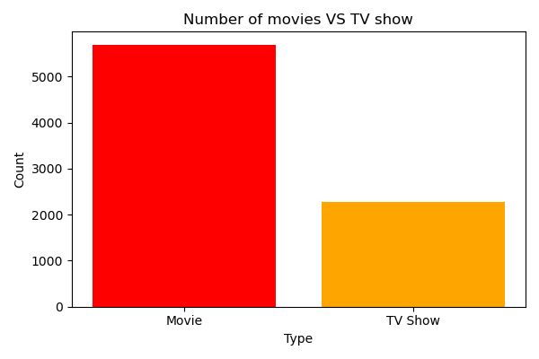
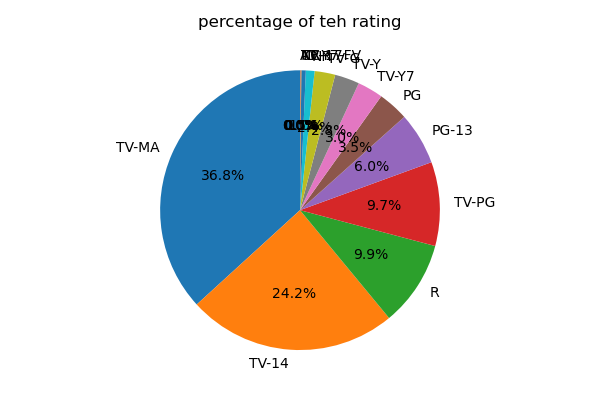
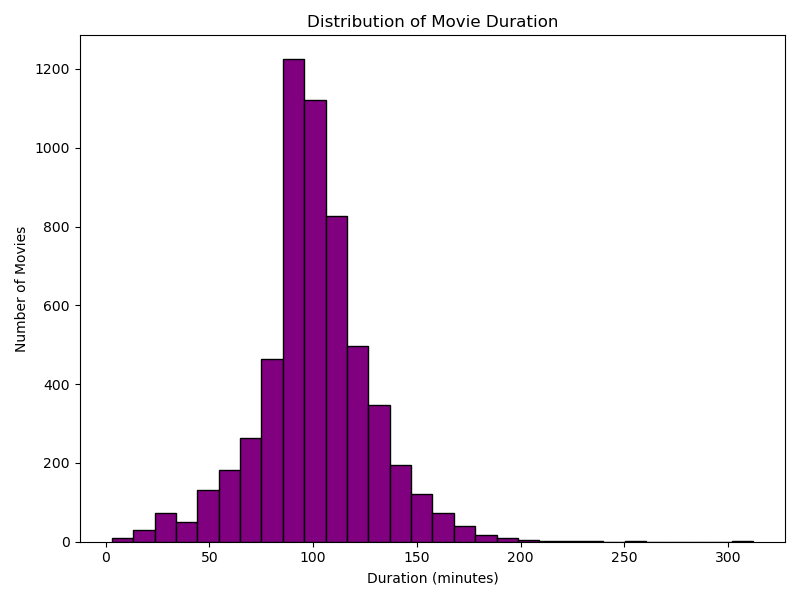
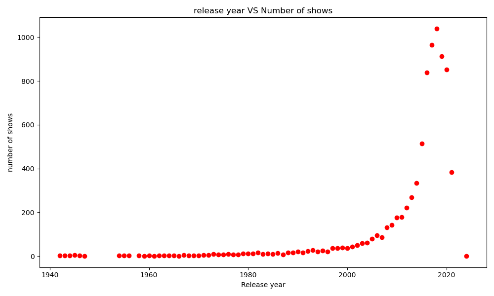
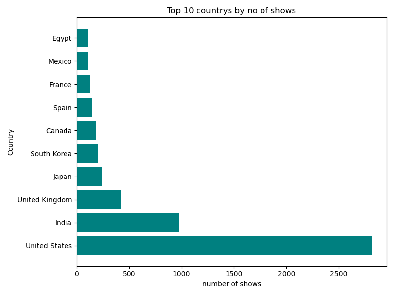
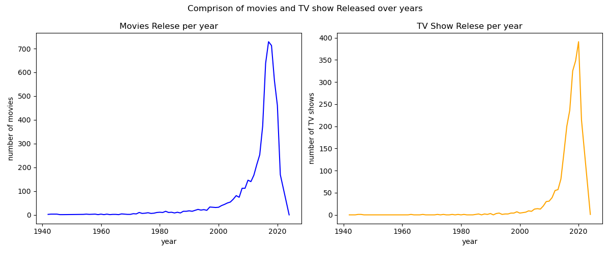

# 🎬 Netflix Content Analysis & Visualization

An exploratory data analysis and visualization project using **Python, Pandas, and Matplotlib** to analyze Netflix movies and TV shows.

The project explores content types, ratings, movie durations, release-year trends, country-wise content distribution, and the growth of movies and TV shows over time.

---

## 📌 Project Overview

Netflix contains thousands of movies and TV shows from different countries, years, genres, and content ratings.

In this project, the Netflix titles dataset is analyzed using **Pandas** for data cleaning and manipulation and **Matplotlib** for creating visualizations.

The analysis focuses on answering questions such as:

* How many Movies and TV Shows are in the dataset?
* What are the most common content ratings?
* What is the typical duration of Netflix movies?
* How has Netflix content changed over the years?
* Which countries have the most titles?
* How does the release pattern of Movies compare with TV Shows?

---

## 🎯 Objectives

* Load and inspect the Netflix titles dataset.
* Clean missing values from important columns.
* Perform basic exploratory data analysis.
* Analyze Movies vs TV Shows.
* Analyze content-rating distribution.
* Analyze movie-duration distribution.
* Study content production by release year.
* Identify the top countries by number of titles.
* Compare Movies and TV Shows released over time.
* Present findings through clear visualizations.

---

## 🛠️ Technologies Used

| Technology          | Purpose                              |
| ------------------- | ------------------------------------ |
| 🐍 Python           | Programming language                 |
| 🐼 Pandas           | Data loading, cleaning and analysis  |
| 📊 Matplotlib       | Data visualization                   |
| 📓 Jupyter Notebook | Development and analysis environment |

---

## 📂 Dataset

The project uses the **Netflix Titles Dataset**, containing information about Netflix movies and TV shows.

Important columns used in this analysis include:

* `type`
* `release_year`
* `rating`
* `country`
* `duration`

The dataset is loaded using Pandas:

```python
df = pd.read_csv('netflix_titles.csv', encoding='latin1')
```

---

## 🧹 Data Cleaning

Before performing the analysis, rows with missing values in the important analysis columns were removed:

```python
df = df.dropna(
    subset=['type', 'release_year', 'rating', 'country', 'duration']
)
```

This ensures that the visualizations are based on records containing the required information.

---

# 📊 Exploratory Data Analysis

## 1. 🎥 Movies vs TV Shows

The first visualization compares the number of Movies and TV Shows in the dataset.

```python
type_count = df['type'].value_counts()

plt.bar(
    type_count.index,
    type_count.values
)
```

### Observation

The dataset contains considerably more **Movies** than **TV Shows**.



---

## 2. 🔞 Content Rating Distribution

A pie chart is used to examine the distribution of Netflix content across different ratings.

```python
rating_counts = df['rating'].value_counts()

plt.pie(
    rating_counts,
    labels=rating_counts.index,
    autopct='%1.1f%%',
    startangle=90
)
```

### Observation

The visualization shows that ratings such as **TV-MA** and **TV-14** represent a large proportion of the available content.



---

## 3. ⏱️ Movie Duration Distribution

The project analyzes the distribution of movie durations.

Because the original `duration` column contains values such as `"90 min"`, the numeric duration is extracted before plotting:

```python
movie_df = df[df['type'] == 'Movie'].copy()

movie_df['duration_int'] = (
    movie_df['duration']
    .str.replace('min', '')
    .astype(int)
)
```

A histogram is then used to visualize the distribution.



### Observation

Most movies are concentrated roughly around the **80–120 minute** range, with fewer movies at very short or very long durations.

---

## 4. 📅 Release Year vs Number of Shows

The project counts the number of titles released in each year:

```python
release_counts = (
    df['release_year']
    .value_counts()
    .sort_index()
)
```

A scatter plot is then used to visualize the trend.



### Observation

Netflix content production increases significantly in the more recent years, with a particularly large concentration of titles released during the 2010s and early 2020s.

---

## 5. 🌍 Top 10 Countries by Number of Shows

The project identifies the ten countries with the highest number of titles:

```python
country_counts = (
    df['country']
    .value_counts()
    .head(10)
)
```

A horizontal bar chart is used for easier comparison.



### Observation

The **United States** has the highest number of titles in the analyzed dataset, followed by **India** and the **United Kingdom**.

---

## 6. 📈 Movies vs TV Shows Released Over Time

The project groups content by both release year and type:

```python
content_by_year = (
    df.groupby(['release_year', 'type'])
      .size()
      .unstack()
      .fillna(0)
)
```

Two line charts are then used to compare Movies and TV Shows.



### Observation

Both Movies and TV Shows show strong growth in the number of titles released in recent years. Movies generally have higher yearly counts, while TV Shows also show substantial growth in the later years.

---

# 📌 Key Findings

Based on the visual analysis:

* 🎬 **Movies outnumber TV Shows** in the dataset.
* 🔞 **TV-MA and TV-14** are among the most common content ratings.
* ⏱️ Most movies have durations concentrated around **80–120 minutes**.
* 📈 Netflix content production increased substantially during the **2010s and early 2020s**.
* 🇺🇸 The **United States** has the largest number of titles among the countries shown.
* 📺 TV Shows have also experienced significant growth over recent years.
* 📊 The dataset demonstrates a strong shift toward greater content production in recent years.

---

# 📁 Project Structure

```text
Netflix-Content-Analysis-and-Visualization/
│
├── Netflix-Content-Analysis-and-Visualization.ipynb
├── netflix_titles.csv
│
├── movies_vs_tvshow.png
├── content_rating_pie.png
├── movies_duration_histogram.png
├── Release_year_scatter.png
├── top10_countries.png
├── movies_tv_show_comparison.png
│
└── README.md
```

---

# 🚀 How to Run the Project

### 1. Clone the repository

```bash
git clone https://github.com/shubhammlondhe2005/Netflix-Content-Analysis-and-Visualization.git
```

### 2. Navigate into the project

```bash
cd Netflix-Content-Analysis-and-Visualization
```

### 3. Install the required libraries

```bash
pip install pandas matplotlib jupyter
```

### 4. Start Jupyter Notebook

```bash
jupyter notebook
```

### 5. Open

```text
Netflix-Content-Analysis-and-Visualization.ipynb
```

Run the cells sequentially.

---

# 📊 Visualizations Included

| Visualization                | Purpose                           |
| ---------------------------- | --------------------------------- |
| Movies vs TV Shows           | Compare content types             |
| Content Rating Pie Chart     | Analyze rating distribution       |
| Movie Duration Histogram     | Analyze movie-length distribution |
| Release Year Scatter Plot    | Analyze yearly content production |
| Top 10 Countries             | Compare country-wise content      |
| Movies vs TV Shows Over Time | Compare yearly release trends     |

---

# 💡 What I Learned

Through this project, I practiced:

* Loading datasets with Pandas
* Handling missing data
* Filtering DataFrames
* Counting categorical values
* Grouping data
* Creating derived columns
* Extracting numeric values from strings
* Using `value_counts()`
* Using `groupby()`
* Using `unstack()`
* Creating bar charts
* Creating pie charts
* Creating histograms
* Creating scatter plots
* Creating line charts
* Saving Matplotlib visualizations

---

# 🔮 Future Improvements

The project can be extended by adding:

* Genre analysis
* Director and cast analysis
* Country-wise rating analysis
* Year-wise rating trends
* Most common genres
* Movie vs TV Show genre comparison
* Interactive dashboards
* Seaborn visualizations
* Plotly visualizations
* More detailed statistical analysis

---

## 👨‍💻 Author

**Shubham Londhe**

B.Tech Computer Science — Artificial Intelligence & Machine Learning
JSPM University, Pune

### Interests

**Machine Learning • NLP • Generative AI • Agentic AI • Data Analytics**

---

⭐ If you found this project useful, consider giving the repository a star!
